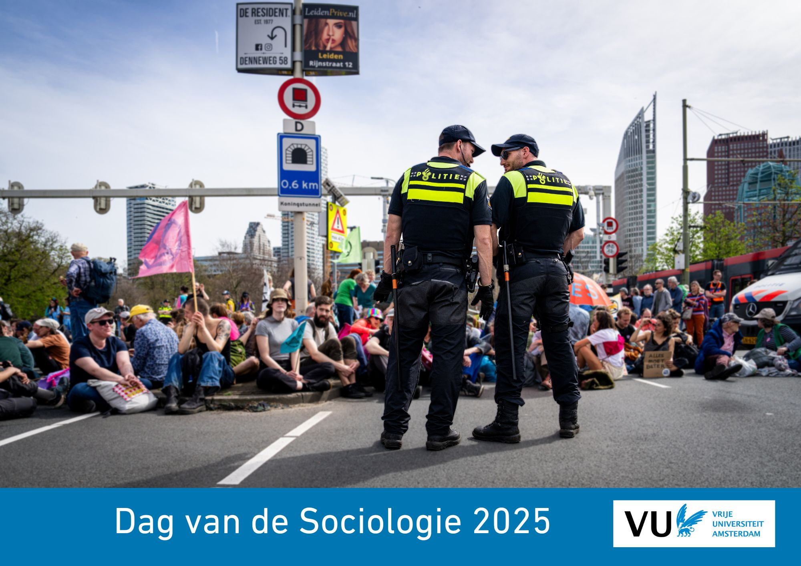

```{r, echo=FALSE, , out.width="75%", out.height="75%"}

```

```{=html}
<!---
https://stackoverflow.com/questions/30110377/saving-leaflet-output-as-html
--->
```
```{r, globalsettings, echo=FALSE, warning=FALSE, message=FALSE, results='hide'}
library(knitr)
opts_chunk$set(tidy.opts=list(width.cutoff=100),tidy=TRUE, warning = FALSE, message = FALSE,comment = "#>", cache=TRUE, class.source=c("test"), class.output=c("test2"), cache.lazy = FALSE, echo = FALSE)
options(width = 100) 
rgl::setupKnitr()

colorize <- function(x, color) {sprintf("<span style='color: %s;'>%s</span>", color, x) }

```

```{r klippy, echo=FALSE, include=TRUE, message=FALSE}
#install.packages("remotes")
#remotes::install_github("rlesur/klippy")
klippy::klippy(position = c('top', 'right'))
#klippy::klippy(color = 'darkred')
#klippy::klippy(tooltip_message = 'Click to copy', tooltip_success = 'Done')
```

------------------------------------------------------------------------

# Route

Plan uw route [hier](https://maps.app.goo.gl/2DGq2o79JUx8Rbmr5). Kies
als bestemming het Hoofdgebouw van de Vrije Universiteit Amsterdam, De
Boelelaan 1105, Amsterdam.

Trein:

-   Station Amsterdam Zuid (vanaf hier is het ongeveer 10 min lopen)

## Locatie

Wij heten u welkom in het Hoofdgebouw van de Vrije Universiteit
Amsterdam. Een plattegrond van de VU-Campus vind u
[hier](https://assets-us-01.kc-usercontent.com/d8b6f1f5-816c-005b-1dc1-e363dd7ce9a5/5dab4300-e3ae-443f-8136-f1c2489af3ef/Campus%20plattegrond%20NL%20dec24.pdf).

```{r, echo=FALSE, message=FALSE, results='hide'}
fpackage.check <- function(packages) {
    lapply(packages, FUN = function(x) {
        if (!require(x, character.only = TRUE)) {
            install.packages(x, dependencies = TRUE)
            library(x, character.only = TRUE)
        }
    })
}

packages = c("tidyverse", "sf", "ggplot2", "ggimage", "ggmap", "leaflet", "patchwork")

fpackage.check(packages)
```

<br>

```{r, echo=FALSE, fig.cap="locatie Hoofdgebouw VU"}
#leaflet::leaflet() |>
#    leaflet::addTiles() |>
#    leaflet::setView(lng = 5.86190, lat = 51.81913, zoom = 15) |>
#    addMarkers(5.86190, 51.8190)

library(leaflet)

leaflet() %>%
  addTiles() %>%
  setView(lng = 4.8656, lat = 52.3336, zoom = 15) %>%
  addMarkers(lng = 4.8656, lat = 52.3336, popup = "VU Amsterdam Main Building")


```

<br> <br>

## Zalen

Info volgt nog.

<br>

------------------------------------------------------------------------

## Hotels

Info volgt nog.

```{=html}
<!---

[Hotel Valdin la Boutique](https://laboutiquenijmegen.nl/)

Van Peltlaan 4, Nijmegen\
Afstand 1.5km, 11 minuten

------------------------------------------------------------------------

[Blue by Manna](https://manna-nijmegen.nl/en/hotel-blue/)

Oranjesingel 2C Afstand 3.5km, 28 minuten Bus 6, 10 of 14

------------------------------------------------------------------------

[Hotel Oranjestaete](https://www.hoteloranjestaete.nl/nl/)

Oranjesingel 66, Nijmegen\
Afstand 1.7km 23 minuten Bus 58

------------------------------------------------------------------------

[Hotel Vertoef](https://www.guesthousevertoef.com/nl/)

Nassausingel 3, Nijmegen\
Afstand 3.3km, 15 minuten Bus 10

------------------------------------------------------------------------

[Mercure](https://www.mercure-hotel-nijmegen-center.nl/?utm_source=GoogleMyBusiness&utm_medium=ButtonWebsite&utm_campaign=GoogleMyBusinessReferral)

Stationsplein 29, Nijmegen\
Afstand 3.5km, 11 minuten Bus 6, 9 of 10

------------------------------------------------------------------------

[Sanadome](https://sanadome.nl/)

Weg door het Jonkerbos 90\
Afstand 4.1km, 23-26 minuten Bus 12 of 15

------------------------------------------------------------------------

[Val Monte](https://www.parkhotelvalmonte.nl/nl/)

Oude Holleweg 5, Berg en Dal\
Afstand 6.2km, 10 minuten auto

------------------------------------------------------------------------

[Holthurnse Hof](https://www.landgoedhotelbergendal.nl/nl/)

Zevenheuvelenweg 48A, Berg en Dal Afstand 7.2km, 13 minuten auto

------------------------------------------------------------------------

[Van der
Valk](https://www.valknijmegen.nl/hotelkamers?gad_source=1&gclid=CjwKCAiAlcyuBhBnEiwAOGZ2S7wR3EMhppzIRAClQMdq179xKNBj0RFiwXVujl22on2PLWBzQfKBwxoCYlYQAvD_BwE#)

Hertog Eduardplein 4, Lent\
Afstand 5.7km, 32 minuten Bus 15

--->
```
