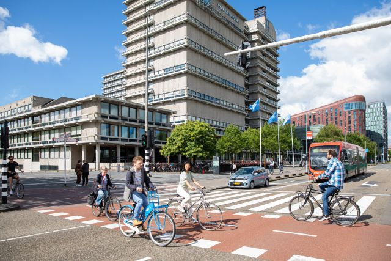

```{r, echo=FALSE, , out.width="75%", out.height="75%"}
knitr::include_graphics("1_NL.jpg")
```

```{=html}
<!---
https://stackoverflow.com/questions/30110377/saving-leaflet-output-as-html
--->
```
```{r, globalsettings, echo=FALSE, warning=FALSE, message=FALSE, results='hide'}
library(knitr)
opts_chunk$set(tidy.opts=list(width.cutoff=100),tidy=TRUE, warning = FALSE, message = FALSE,comment = "#>", cache=TRUE, class.source=c("test"), class.output=c("test2"), cache.lazy = FALSE, echo = FALSE)
options(width = 100) 
rgl::setupKnitr()

colorize <- function(x, color) {sprintf("<span style='color: %s;'>%s</span>", color, x) }

```

```{r klippy, echo=FALSE, include=TRUE, message=FALSE}
#install.packages("remotes")
#remotes::install_github("rlesur/klippy")
klippy::klippy(position = c('top', 'right'))
#klippy::klippy(color = 'darkred')
#klippy::klippy(tooltip_message = 'Click to copy', tooltip_success = 'Done')
```

------------------------------------------------------------------------

## Route

Plan uw route [hier](https://maps.app.goo.gl/2DGq2o79JUx8Rbmr5). Kies
als bestemming het Hoofdgebouw van de Vrije Universiteit Amsterdam, De
Boelelaan 1105, Amsterdam.

Trein:

-   Station Amsterdam Zuid (vanaf hier is het ongeveer 10 min lopen)

Auto:

-   Op [deze website vind u meer info over parkeren bij de VU](https://www.parkerenbijvu.nl/).

------------------------------------------------------------------------

## Locatie

Wij heten u welkom in het Hoofdgebouw van de Vrije Universiteit
Amsterdam. Een plattegrond van de VU-Campus vind u
[hier](https://assets-us-01.kc-usercontent.com/d8b6f1f5-816c-005b-1dc1-e363dd7ce9a5/5dab4300-e3ae-443f-8136-f1c2489af3ef/Campus%20plattegrond%20NL%20dec24.pdf).

```{r, echo=FALSE, message=FALSE, results='hide'}

### automatisch packages installeren heb ik weggehaald (=onhandig)
### zelf alleen library toegevoegd.

#fpackage.check <- function(packages) {
#    lapply(packages, FUN = function(x) {
#        if (!require(x, character.only = TRUE)) {
#            install.packages(x, dependencies = TRUE)
#            library(x, character.only = TRUE)
#        }
#    })
#}
#
#packages = c("tidyverse", "sf", "ggplot2", "ggimage", "ggmap", "leaflet", "patchwork")
#
#fpackage.check(packages)

library(tidyverse)
library(sf)
library(ggplot2)
library(ggimage)
library(ggmap)
library(leaflet)
library(patchwork)
library(knitr)
library(klippy)
library(rgl)

```
<br>

```{r, echo=FALSE}
#leaflet::leaflet() |>
#    leaflet::addTiles() |>
#    leaflet::setView(lng = 5.86190, lat = 51.81913, zoom = 15) |>
#    addMarkers(5.86190, 51.8190)

library(leaflet)

leaflet() %>%
  addTiles() %>%
  setView(lng = 4.8656, lat = 52.3336, zoom = 15) %>%
  addMarkers(lng = 4.8656, lat = 52.3336, popup = "VU Amsterdam Main Building")

```

```{r, echo=FALSE, out.width="60%", out.height="60%", fig.cap="Hoofdgebouw VU"}

```
 
<br>
------------------------------------------------------------------------

## Gebouwen en toegankelijkheid

In ieder gebouw is een gastdame/ heer aanwezig. U kunt bij hen terecht met al uw vragen. Mensen met een beperking die een probleem ondervinden en niet in de buurt van een Centrale Hal zijn, kunnen bellen naar: 020 59 85854.

Meer informatie over voorzieningen voor mensen met een beperking, o.a. locatie van aangepaste toiletten,
[vind u op deze pagina](https://vu.nl/nl/over-de-vu/meer-over/voorzieningen-voor-mensen-met-een-beperking)

[Link naar de Campus plattegrond](https://vu.nl/nl/over-de-vu/meer-over/plattegrond-vu-campus)
<br>
```{r, echo=FALSE, out.width="100%", out.height="80%", fig.cap="Plattegrond VU Campus"}

```
 
<br>

------------------------------------------------------------------------

## Hotels

[citizenM hotel Amsterdam Zuid](https://www.citizenm.com/nl/hotels/europa/amsterdam/zuid-hotel?utm_source=google&utm_medium=cpc&utm_campaign=o:NL-m:CM-ch:SEA-ph:ALWON-l:NL-cat:HT-ct:BRAND-dco:NL-r:D-cit:AMSTERDAM-h:ALL&gad_source=1&gad_campaignid=16101105357&gclid=CjwKCAjw_pDBBhBMEiwAmY02Npl9SkdxYdkvgWoxq33e2hNKledtl-BhJvMiPNx2Rb6VtKbF4GoX3BoCoB0QAvD_BwE)\
Prinses Irenestraat 30, Amsterdam

[Hotel Ibis Budget Amsterdam Zuid](https://all.accor.com/hotel/A3P2/index.nl.shtml)\
Prof J. H. Bavincklaan 1, Amstelveen

[Hotel NH Amsterdam Zuid](https://www.nh-hotels.com/en/hotel/nh-amsterdam-zuid?campid=8435708&utm_campaign=nh_hotel&utm_source=google&utm_medium=cpc&utm_id=22343106421&utm_source_platform=sa360&gclsrc=aw.ds&gad_source=1&gad_campaignid=22343106421&gclid=CjwKCAjw_pDBBhBMEiwAmY02NriPEjw6PAyOizslYFsyqsSnj_ZM0KErS66xFf4sFOJRsP4wcuL1MxoCdvkQAvD_BwE)\
Van Leijenberghlaan 221, Amsterdam

[PREMIER SUITES Amsterdam](https://www.premiersuiteseurope.com/nl/locaties/nederland/amsterdam/serviced-apartments-amsterdam)\
The Hourglass - Parnassusweg 376, Amsterdam

------------------------------------------------------------------------
## Uit eten in de buurt van VU Campus / Station Zuid

[Limon](https://limon.amsterdam/) <br>
Gustav Mahlerplein 222

[Market33, Local Urban Food Hall](https://market33.nl/nl/)\
Foodhall vlakbij station Zuid (2 minuten lopen) met stuk of tien verschillende kraampjes (Thais, Japans, Mexicaans, burgers etc.) <br> 
Claude Debussylaan 33

[Wagamama](https://www.wagamama.nl/restaurants/zuidplein)\
Asian fusion <br> 
Zuidplein 12


