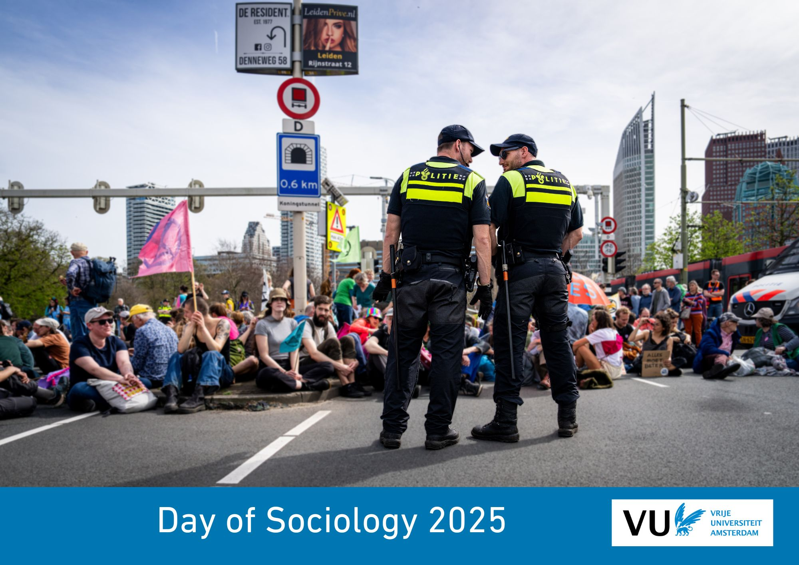

```{r, echo=FALSE, , out.width="75%", out.height="75%"}

```

```{=html}
<!---
https://stackoverflow.com/questions/30110377/saving-leaflet-output-as-html
--->
```
```{r, globalsettings, echo=FALSE, warning=FALSE, message=FALSE, results='hide'}
library(knitr)
opts_chunk$set(tidy.opts=list(width.cutoff=100),tidy=TRUE, warning = FALSE, message = FALSE,comment = "#>", cache=TRUE, class.source=c("test"), class.output=c("test2"), cache.lazy = FALSE)
options(width = 100) 
rgl::setupKnitr()

colorize <- function(x, color) {sprintf("<span style='color: %s;'>%s</span>", color, x) }

```

```{r klippy, echo=FALSE, include=TRUE, message=FALSE}
# install.packages("remotes")
#remotes::install_github("rlesur/klippy")
klippy::klippy(position = c('top', 'right'))
#klippy::klippy(color = 'darkred')
#klippy::klippy(tooltip_message = 'Click to copy', tooltip_success = 'Done')
```

------------------------------------------------------------------------

# Route

Plan your route [here](https://maps.app.goo.gl/2DGq2o79JUx8Rbmr5). Choose the Main Building of the Vrije Universiteit Amsterdam as your destination, De Boelaan 1105, Amsterdam.

Train:

-   Amsterdam South (*Station Amsterdam Zuid*), (about 10 minutes walk from here

## Location

You will find the Main Building of the VU Amsterdam here:

```{r, echo=FALSE, message=FALSE, results='hide'}
fpackage.check <- function(packages) {
    lapply(packages, FUN = function(x) {
        if (!require(x, character.only = TRUE)) {
            install.packages(x, dependencies = TRUE)
            library(x, character.only = TRUE)
        }
    })
}

packages = c("tidyverse", "sf", "ggplot2", "ggimage", "ggmap", "leaflet", "patchwork", "leaflet.extras2", "htmlwidgets", "webshot")

fpackage.check(packages)
```

```{r, echo=FALSE}
library(leaflet)

leaflet() %>%
  addTiles() %>%
  setView(lng = 4.8656, lat = 52.3336, zoom = 15) %>%
  addMarkers(lng = 4.8656, lat = 52.3336, popup = "VU Amsterdam Main Building")

```

```{r, echo=FALSE, out.width="60%", out.height="60%", fig.cap = "VU Main Building"}
knitr::include_graphics("1-HG_LowRes.jpg")
```

<br> 

## Rooms

More information will follow later.\
<br>

------------------------------------------------------------------------

## Hotels

More information will follow later.

```{=html}
<!--

[Hotel Valdin la Boutique](https://laboutiquenijmegen.nl/)

Van Peltlaan 4, Nijmegen    
Distance 1.5km, 11 minutes

----

[Blue by Manna](https://manna-nijmegen.nl/en/hotel-blue/)

Oranjesingel 2C 
Distance 3.5km, 28 minutes
Bus 6, 10  of 14

----

[Hotel Oranjestaete](https://www.hoteloranjestaete.nl/nl/)

Oranjesingel 66, Nijmegen    
Distance 1.7km  23 minutes
Bus 58

----

[Hotel Vertoef](https://www.guesthousevertoef.com/nl/)

Nassausingel 3, Nijmegen    
Distance 3.3km, 15 minutes
Bus 10

----

[Mercure](https://www.mercure-hotel-nijmegen-center.nl/?utm_source=GoogleMyBusiness&utm_medium=ButtonWebsite&utm_campaign=GoogleMyBusinessReferral)

Stationsplein 29, Nijmegen  
Distance 3.5km, 11 minutes
Bus 6, 9 of 10

----

[Sanadome](https://sanadome.nl/)

Weg door het Jonkerbos 90   
Distance 4.1km, 23-26 minutes
Bus 12 of 15

----

[Val Monte](https://www.parkhotelvalmonte.nl/nl/)

Oude Holleweg 5, Berg en Dal    
Distance 6.2km, 10 minutes by car

----

[Holthurnse Hof](https://www.landgoedhotelbergendal.nl/nl/)

Zevenheuvelenweg 48A, Berg en Dal
Distance 7.2km, 13 minutes by car

----

[Van der Valk](https://www.valknijmegen.nl/hotelkamers?gad_source=1&gclid=CjwKCAiAlcyuBhBnEiwAOGZ2S7wR3EMhppzIRAClQMdq179xKNBj0RFiwXVujl22on2PLWBzQfKBwxoCYlYQAvD_BwE#)

Hertog Eduardplein 4, Lent  
Distance 5.7km,     32 minutes
Bus 15

-->
```
