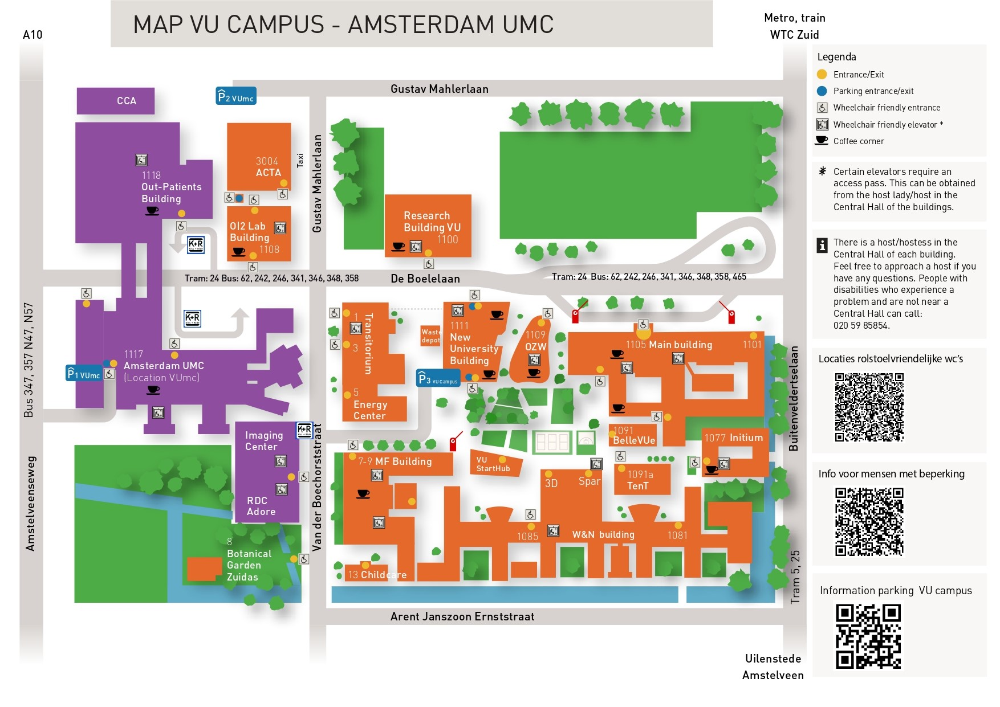

```{r, echo=FALSE, , out.width="75%", out.height="75%"}
knitr::include_graphics("1_ENG.jpg")
```

```{=html}
<!---
https://stackoverflow.com/questions/30110377/saving-leaflet-output-as-html
--->
```
```{r, globalsettings, echo=FALSE, warning=FALSE, message=FALSE, results='hide'}
library(knitr)
opts_chunk$set(tidy.opts=list(width.cutoff=100),tidy=TRUE, warning = FALSE, message = FALSE,comment = "#>", cache=TRUE, class.source=c("test"), class.output=c("test2"), cache.lazy = FALSE)
options(width = 100) 
rgl::setupKnitr()

colorize <- function(x, color) {sprintf("<span style='color: %s;'>%s</span>", color, x) }

```

```{r klippy, echo=FALSE, include=TRUE, message=FALSE}
# install.packages("remotes")
#remotes::install_github("rlesur/klippy")
klippy::klippy(position = c('top', 'right'))
#klippy::klippy(color = 'darkred')
#klippy::klippy(tooltip_message = 'Click to copy', tooltip_success = 'Done')
```

------------------------------------------------------------------------

## Route

Plan your route [here](https://maps.app.goo.gl/2DGq2o79JUx8Rbmr5). Choose the Main Building of the Vrije Universiteit Amsterdam as your destination, De Boelaan 1105, Amsterdam.

Train:

-   Amsterdam South (*Station Amsterdam Zuid*), (about 10 minutes walk from here

------------------------------------------------------------------------

## Location

You will find the Main Building of the VU Amsterdam here:

```{r, echo=FALSE, message=FALSE, results='hide'}

library(tidyverse)
library(sf)
library(ggplot2)
library(ggimage)
library(ggmap)
library(leaflet)
library(patchwork)
library(knitr)
library(klippy)
library(rgl)

```

```{r, echo=FALSE}
library(leaflet)

leaflet() %>%
  addTiles() %>%
  setView(lng = 4.8656, lat = 52.3336, zoom = 15) %>%
  addMarkers(lng = 4.8656, lat = 52.3336, popup = "VU Amsterdam Main Building")

```

```{r, echo=FALSE, out.width="60%", out.height="60%", fig.cap = "VU Main Building"}
knitr::include_graphics("1-HG_LowRes.jpg")
```

<br> 
------------------------------------------------------------------------

## Buildings and Accessibility

A host or hostess is present in every building. You can contact them with any questions you may have.
People with disabilities who encounter a problem and are not near a Central Hall can call: **020 59 85854**.

For more information about facilities for people with a disability, including the location of accessible toilets,
[please visit this page](https://vu.nl/en/about-vu/more-about/facilities-for-people-with-a-disability).

[Link to Campus map](https://vu.nl/en/about-vu/more-about/vu-campus-map)
<br>

```{r, echo=FALSE, out.width="120%", out.height="100%", fig.cap="Plattegrond VU Campus"}

```
 
<br>

------------------------------------------------------------------------

## Hotels

[citizenM hotel Amsterdam Zuid](https://www.citizenm.com/nl/hotels/europa/amsterdam/zuid-hotel?utm_source=google&utm_medium=cpc&utm_campaign=o:NL-m:CM-ch:SEA-ph:ALWON-l:NL-cat:HT-ct:BRAND-dco:NL-r:D-cit:AMSTERDAM-h:ALL&gad_source=1&gad_campaignid=16101105357&gclid=CjwKCAjw_pDBBhBMEiwAmY02Npl9SkdxYdkvgWoxq33e2hNKledtl-BhJvMiPNx2Rb6VtKbF4GoX3BoCoB0QAvD_BwE) <br>
Prinses Irenestraat 30, Amsterdam

[Hotel Ibis Budget Amsterdam Zuid](https://all.accor.com/hotel/A3P2/index.nl.shtml) <br>
Prof J. H. Bavincklaan 1, Amstelveen

[Hotel NH Amsterdam Zuid](https://www.nh-hotels.com/en/hotel/nh-amsterdam-zuid?campid=8435708&utm_campaign=nh_hotel&utm_source=google&utm_medium=cpc&utm_id=22343106421&utm_source_platform=sa360&gclsrc=aw.ds&gad_source=1&gad_campaignid=22343106421&gclid=CjwKCAjw_pDBBhBMEiwAmY02NriPEjw6PAyOizslYFsyqsSnj_ZM0KErS66xFf4sFOJRsP4wcuL1MxoCdvkQAvD_BwE) <br>
Van Leijenberghlaan 221, Amsterdam

[PREMIER SUITES Amsterdam](https://www.premiersuiteseurope.com/nl/locaties/nederland/amsterdam/serviced-apartments-amsterdam) <br>
The Hourglass - Parnassusweg 376, Amsterdam

------------------------------------------------------------------------

## Dining Near VU Campus / Station Zuid

[Limon](https://limon.amsterdam/) <br>
Gustav Mahlerplein 222

[Market33, Local Urban Food Hall](https://market33.nl/nl/) <br>
A food hall near Amsterdam-Zuid Station (2-minute walk) with around ten different stalls (Thai, Japanese, Mexican, burgers, etc.) <br>
Claude Debussylaan 33

[Wagamama](https://www.wagamama.nl/restaurants/zuidplein) <br>
Asian fusion, next to Amsterdam-Zuid Station <br>
Zuidplein 12

[De Veranda](https://deveranda.nl/) <br>
Next to the "Amsterdamse Bos" (Amsterdam Forest), with a spacious terrace <br>
Amstelveensweg 764, Amsterdam

[Gustavino](https://www.restaurantgustavino.nl/) <br>
Restaurant & Vinoteca <br>
Gustav Mahlerplein 16
