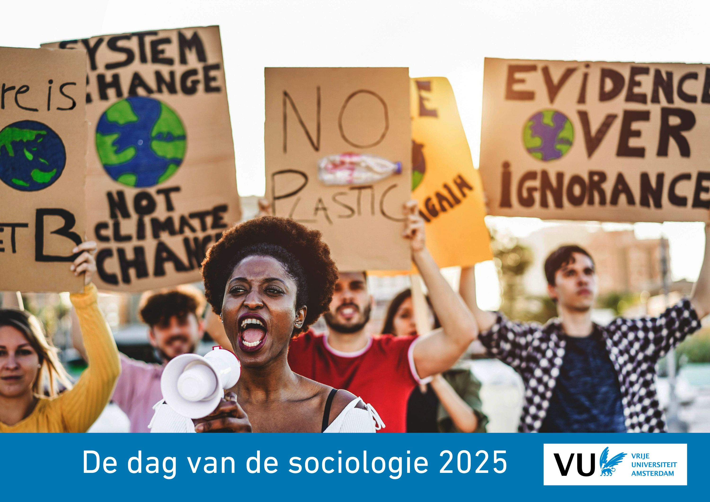

```{r, echo=FALSE, , out.width="75%", out.height="75%"}
knitr::include_graphics("5_NL.jpg")
```

```{r, globalsettings, echo=FALSE, warning=FALSE, message=FALSE, results='hide'}
library(knitr)
opts_chunk$set(tidy.opts=list(width.cutoff=100),tidy=TRUE, warning = FALSE, message = FALSE,comment = "#>", cache=TRUE, class.source=c("test"), class.output=c("test2"), cache.lazy = FALSE)
options(width = 100) 
rgl::setupKnitr()

colorize <- function(x, color) {sprintf("<span style='color: %s;'>%s</span>", color, x) }

```

```{r klippy, echo=FALSE, include=TRUE, message=FALSE}
# install.packages("remotes")
#remotes::install_github("rlesur/klippy")
klippy::klippy(position = c('top', 'right'))
#klippy::klippy(color = 'darkred')
#klippy::klippy(tooltip_message = 'Click to copy', tooltip_success = 'Done')
```

<!-- U kunt het programma hier downloaden als pdf [dvds2024.pdf]().   -->

<!-- data input -->

```{r, eval = TRUE, echo=FALSE}
getwd()
library(readxl)
library(tidyverse)
#test <- read_xlsx("paper_total_sessies_2025.xlsx")
test <- read_excel ("C:/Users/jms390/OneDrive - Vrije Universiteit Amsterdam/Documents/GitHub/dvds2025/paper_total_sessies_2025.xlsx")

test$auttitel <- paste(test$naam, test$titel_paper, sep = ": ")
test$taal <- ifelse(test$Taal == "NL", "Nederlands", test$Taal)
test$taal <- ifelse(test$Taal == "ENG", "English", test$Taal)
```

<br>
<br>

Op deze pagina vindt u:

-   [Programmaoverzicht](#overzicht)
-   [Informatie over de plenaire sessie](#keynotes)\
-   [Overzicht van alle sessies](#sessies)\
-   [Overzicht van alle presentaties](#papers)
-   [Aanwijzingen vooor presentatie](#details)

Het programma is het laatst aangepast op **`r format(Sys.time(), format="%d %B %Y")`** om **`r substr(Sys.time(), 12,16)`**

--->

------------------------------------------------------------------------

## Programmaoverzicht {#overzicht}

```{r, echo = FALSE}
library(knitr)
library(kableExtra)


wat <- c("Inloop (koffie)", "Sessies Ronde 1", "Pauze", "Sessies Ronde 2", "ledenvergadering NSV (incl. lunch)", "lunch", "Plenaire Sessie (keynotes)", "Pauze"," Sessies Ronde 3", "Borrel")
wanneer <- c("9:00-9:30", "9:30-10:45", "10:45-11:00", "11:00-12:30", "12:30-13:45", "12:30-13:45", "13:45-15:30", "15:30-16:00", "16:00-17:30", "17:30-18:30" )
waar <- c("Iris (verdieping 1)","MM","Iris (verdieping 1)","MM","MM02.630", "Refter","MM00.029","Iris (verdieping 1)","MM","Iris (verdieping 1)")
df <- data.frame( wanneer=wanneer, wat=wat, waar=waar)

knitr::kable(df, align = "lcc", booktabs = TRUE) %>%
  kable_styling(latex_options = "striped") %>% 
    kable_styling(font_size = 15) %>% 
  row_spec(7, color = 'white', background = 'darkgrey') 
```

--->

<!---keynotes
## Keynotes {#keynotes}
--->

```{=html}
<!---
<div style="background-color: blue; width: 100%; height: 650px;">  --->
```
<!---
::: {style="background-color: #CCCCCC; width: 50%; height: 600px; float:left; margin: auto; padding: 20px; box-sizing: border-box; overflow-y: auto;"}
--->

```{r, echo=FALSE, out.width = "120px"}
#jm# 
```


<!---
[Ingrid Boas](https://www.wur.nl/en/persons/ingrid-boas.htm) is universitair hoofddocent bij de Environmental Policy Group aan de Wageningen University. In haar onderzoek richt zij zich op milieubeheer, mobiliteit en bestuur. Zo onderzoekt zij de relatie tussen klimaatverandering en menselijke (im)mobiliteit en hoe dit zich op diverse manieren manifesteert in verschillende delen van de wereld.

In haar keynote, zal ze putten uit resultaten van haar eerdere Veni-onderzoek en lopende Vidi-beurs over klimaatgerelateerde mobiliteit in grensgebieden. Ze besteedt aandacht aan de verschillende manieren hoe klimaatverandering gevolgen heeft voor mobiliteit en hoe de relatie tussen klimaat en mobiliteit geduid wordt, ook op politiek vlak. Vanuit het perspectief van een interdisciplinaire wetenschapper zal ze schetsen waar ze mogelijkheden ziet voor een meer sociologische onderzoeksaanpak op het gebied van klimaatmobiliteitsonderzoek in Nederland en België.
:::

::: {style="background-color: #DCDCDC; width: 50%; height: 600px; float:left; margin: auto; padding: 20px; box-sizing: border-box; overflow-y: auto;"}
```{r, echo=FALSE, out.width = "120px"}
#jm# 
```

[Ann Crabbé](https://www.uantwerpen.be/en/staff/ann-crabbe/) is senior onderzoeker en lid van het Centre of Research on Environmental and Social Change van de Universiteit Antwerpen. Ann heeft een diploma kandidaat in de sociologie (1998), licentiaat in de bestuurswetenschappen (2000) en is doctor in de politieke en sociale wetenschappen (2008). In haar onderwijs en onderzoek pleit ze sterk voor interdisciplinaire samenwerking om de complexiteit van duurzaamheidsproblemen aan te pakken. Samen met biologe Sara Vicca was ze co-editor van het boek 'Van Klimaatverandering naar Systeemverandering'.

:::

--->

<!---

<br> <br> <br> <br>
-->

------------------------------------------------------------------------

## Overzicht van alle sessies {#sessies}

<br>

```{r, eval = FALSE, echo=FALSE}
#```{r, eval = TRUE, echo=FALSE}
#eval = TRUE: The code will be executed.

test2 <- test %>%
  mutate(Ronde = ifelse(Ronde == 1, "1   9:30-10:45", Ronde), 
         Ronde = ifelse(Ronde == 2, "2   11:00-12:30", Ronde),
         Ronde = ifelse(Ronde == 3, "3   16:00-17:30", Ronde)) %>%
  select(c("Ronde", "Sessie", "Zaal", "auttitel", "Voorzitter", "Taal")) %>%
  group_by(Ronde, Sessie) %>%
  mutate(sum = paste0(auttitel, collapse = "<br>")) %>%
  summarise(Sessie = dplyr::first(Sessie),
            Chair =  dplyr::first(Voorzitter),
            Zaal = dplyr::first(Zaal),
            Bijdragen = as.character(dplyr::first(sum)) )

# knitr::kable(test2, align = "lcl", booktabs = TRUE, escape = F) %>%
#   kable_styling(latex_options = "striped") %>% 
#     kable_styling(font_size = 10)  

library(reactable)
library(reactablefmtr)

groenMM <- rgb(143,149,89, maxColorValue=255)
blauwMM <- rgb(125,159,202, maxColorValue=255)

#groupBy = c("ronde", "sessie")
reactable(test2, 
          
     #       defaultColDef = colDef(
     #         style = cell_style(test2, font_size = "10px")
     # ),
          
          defaultPageSize = 14, filterable = TRUE, searchable = TRUE, highlight = TRUE, 
     showPageSizeOptions = TRUE, pageSizeOptions = c(4, 14, 28, 50), showPagination = TRUE,
  # Give rows a pointer cursor to indicate that they're clickable

          columns = list(
    #samenvatting = colDef(minWidth = 1000),
    Ronde = colDef(minWidth = 60, maxWidth = 110, align = "left"),
    Sessie = colDef(maxWidth = 200, align = "left"),
    Chair = colDef(maxWidth = 100, align = "left"),
    Zaal = colDef(maxWidth = 100, align = "left",
      style = function(value) {
        zaalkleur <- as.numeric(substr(value, 6, 8))
        zaalkleur <- ifelse(zaalkleur>300, groenMM, blauwMM)
        list(background = zaalkleur)
      }),
     Bijdragen = colDef(maxWidth = 300, align = "left", show = TRUE, html = TRUE, style = cell_style(test2, font_size = "10px") )# overrides the default
  )
  )


```


------------------------------------------------------------------------


## Overzicht van alle presentaties {#papers}

Hieronder vindt u het programma van alle presentaties.

-   U kunt zoeken en filteren op `sessie`, `auteur`, etc.
-   Door op de kolomnamen te klikken kunt u sorteren op bijvoorbeeld `ronde` of `sessie`.\
-   Door op het pijltje te klikken kunt u de abstracts lezen.

```{r, eval = TRUE, echo=FALSE}
test3 <- test %>% 
  mutate(Auteur = naam,
         Taal = ifelse(Taal == "N", "Nederlands", Taal),
         Taal = ifelse(Taal == "E", "English", Taal),
         Titel = titel_paper) %>%
  select(c("Ronde", "Sessie", "Zaal", "Auteur", "coauteurs", "Taal", "Titel", "samenvatting_paper"))

groenMM <- rgb(143,149,89, maxColorValue=255)
blauwMM <- rgb(125,159,202, maxColorValue=255)


library(reactable)
#groupBy = c("ronde", "sessie")
reactable(test3, defaultPageSize = 10, filterable = TRUE, searchable = TRUE, highlight = TRUE, showPageSizeOptions = TRUE, pageSizeOptions = c(4, 10, 50, 100, 200), showPagination = TRUE,
        details = function(index) paste("Samenvatting:", test3$samenvatting_paper[index]),
  onClick = "expand",
  # Give rows a pointer cursor to indicate that they're clickable
  rowStyle = list(cursor = "pointer"),
          columns = list(
    #samenvatting = colDef(minWidth = 1000),
    Titel = colDef(minWidth = 200), 
    Ronde = colDef(minWidth = 60, align = "left"),
    Zaal = colDef(
      style = function(value) {
        zaalkleur <- as.numeric(substr(value, 6, 8))
        zaalkleur <- ifelse(zaalkleur>300, groenMM, blauwMM)
        list(background = zaalkleur)
      }),
    samenvatting_paper = colDef(show = FALSE)# overrides the default
  ))
```

<br> <br>

--->

------------------------------------------------------------------------


## Details {#details}

Do's and Don'ts

-   Totaaltijd per spreker hangt van aantal sprekers per sessie:
    -   Sessie 1, 3 sprekers: 25 minuten\
    -   Sessie 1, 4 sprekers: 18 minuten\
    -   Sessie 2/3, 4 sprekers: 22 minuten\
    -   Sessie 2/3, 5 sprekers: 18 minuten

Wij adviseren een presentatietijd van **13 minuten** en de overige tijd te reserveren voor discussie. De discussies vinden plaats direct na elke presentatie.

Het is niet nodig om van te voren je presentatie ergens te uploaden. Je kan je presentatie op een USB meenemen en op de aanwezige computer in de zaal zetten, of je kan je eigen laptop aansluiten (elke type aansluiting is aanwezig).


