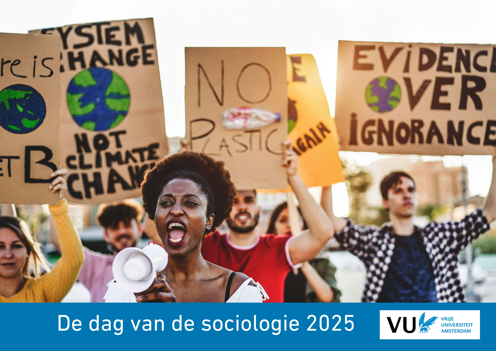

---
title: "Programma"
---  

```{r, echo=FALSE, , out.width="50%", out.height="50%"}

```
 
  
```{r, globalsettings, echo=FALSE, warning=FALSE, message=FALSE, results='hide'}
library(knitr)
opts_chunk$set(tidy.opts=list(width.cutoff=100),tidy=TRUE, warning = FALSE, message = FALSE,comment = "#>", cache=TRUE, class.source=c("test"), class.output=c("test2"), cache.lazy = FALSE)
options(width = 100) 
rgl::setupKnitr()

colorize <- function(x, color) {sprintf("<span style='color: %s;'>%s</span>", color, x) }

```

```{r klippy, echo=FALSE, include=TRUE, message=FALSE}
# install.packages("remotes")
#remotes::install_github("rlesur/klippy")
klippy::klippy(position = c('top', 'right'))
#klippy::klippy(color = 'darkred')
#klippy::klippy(tooltip_message = 'Click to copy', tooltip_success = 'Done')
```

<!-- U kunt het programma hier downloaden als pdf [dvds2024.pdf]().   -->

<!-- data input -->

```{r, eval = TRUE, echo=FALSE}
library(readxl)
library(tidyverse)
test <- read_xls("papers_total_sessies_jt.xls")
test$auttitel <- paste(test$naam, test$titel_paper, sep = "; ")
test$taal <- ifelse(test$taal == "N", "Nederlands", test$taal)
test$taal <- ifelse(test$taal == "E", "English", test$taal)
```


Op deze pagina vindt u:  

- [Programmaoverzicht](#overzicht)
- [Informatie over de keynotes](#keynotes)  
- [Sessieoverzicht](#sessies)  
- [Programmadetails](#details) 

Het programma is het laatst aangepast op **`r format(Sys.time(), format="%d %B %Y")`** om **`r substr(Sys.time(), 12,16)`**

----  

## Overzicht {#overzicht}

```{r, echo = FALSE}
library(knitr)
library(kableExtra)


wat <- c("Inloop (koffie)", "Sessies Ronde 1", "Pauze", "Sessies Ronde 2", "ledenvergadering NSV (incl. lunch)", "lunch", "Plenaire Sessie (keynotes)", "Pauze"," Sessies Ronde 3", "Borrel")
wanneer <- c("9:00-9:30", "9:30-10:45", "10:45-11:00", "11:00-12:30", "12:30-13:45", "12:30-13:45", "13:45-15:30", "15:30-16:00", "16:00-17:30", "17:30-18:30" )
waar <- c("Iris (verdieping 1)","MM","Iris (verdieping 1)","MM","MM02.630", "Refter","MM00.029","Iris (verdieping 1)","MM","Iris (verdieping 1)")
df <- data.frame( wanneer=wanneer, wat=wat, waar=waar)

knitr::kable(df, align = "lcc", booktabs = TRUE) %>%
  kable_styling(latex_options = "striped") %>% 
    kable_styling(font_size = 15) %>% 
  row_spec(7, color = 'white', background = 'darkgrey') 
```


## Keynotes {#keynotes}  
 
 <!---
<div style="background-color: blue; width: 100%; height: 650px;">  --->

<div style="background-color: #CCCCCC; width: 50%; height: 600px; float:left; margin: auto; padding: 20px; box-sizing: border-box; overflow-y: auto;">  

```{r, echo=FALSE, out.width = "120px"}

``` 

[Ingrid Boas]( https://www.wur.nl/en/persons/ingrid-boas.htm) is universitair hoofddocent bij de Environmental Policy Group aan de Wageningen University. In haar onderzoek richt zij zich op milieubeheer, mobiliteit en bestuur. Zo onderzoekt zij de relatie tussen klimaatverandering en menselijke (im)mobiliteit en hoe dit zich op diverse manieren manifesteert in verschillende delen van de wereld.  

In haar keynote, zal ze putten uit resultaten van haar eerdere Veni-onderzoek en lopende Vidi-beurs over klimaatgerelateerde mobiliteit in grensgebieden. Ze besteedt aandacht aan de verschillende manieren hoe klimaatverandering gevolgen heeft voor mobiliteit en hoe de relatie tussen klimaat en mobiliteit geduid wordt, ook op politiek vlak. Vanuit het perspectief van een interdisciplinaire wetenschapper zal ze schetsen waar ze mogelijkheden ziet voor een meer sociologische onderzoeksaanpak op het gebied van klimaatmobiliteitsonderzoek in Nederland en België.
 

</div>  
  
<div style="background-color: #DCDCDC; width: 50%; height: 600px; float:left; margin: auto; padding: 20px; box-sizing: border-box; overflow-y: auto;"> 


```{r, echo=FALSE, out.width = "120px"}

``` 

 [Ann Crabbé](https://www.uantwerpen.be/en/staff/ann-crabbe/) is senior onderzoeker en lid van het Centre of Research on Environmental and Social Change van de Universiteit Antwerpen. Ann heeft een diploma kandidaat in de sociologie (1998), licentiaat in de bestuurswetenschappen (2000) en is doctor in de politieke en sociale wetenschappen (2008). In haar onderwijs en onderzoek pleit ze sterk voor interdisciplinaire samenwerking om de complexiteit van duurzaamheidsproblemen aan te pakken. Samen met biologe Sara Vicca was ze co-editor van het boek 'Van Klimaatverandering naar Systeemverandering'.  
 
In haar keynote zal ze onder andere spreken over het nagenoeg afgeronde project SOLARIS waar ze bij betrokken was. In dit project heeft een multidisciplinaire onderzoeksgroep sociaal-ruimtelijke onrechtvaardigheden als gevolg van klimaatadaptatiebeleid in verschillende landen onderzocht. Ze deelt de lessen die zijn geleerd over de praktijk van multidisciplinair onderzoek naar klimaatverandering en de rol die sociologen hierin  kunnen (en moeten) spelen. 


</div>  

<br> <br>
<br> <br>

<!---
Samen met Sara Vicca redigeerde ze het boek 'Van Klimaatverandering naar Systeemverandering'. Daarin stelt ze dat de oplossingen voor en aanpassingen aan de klimaat verandering van vele sectoren en disciplines moeten komen.  
--->

---   

## Sessies {#sessies}

<br>  


```{r, eval = TRUE, echo=FALSE}
test2 <- test %>%
  mutate(sessie = panel, 
         ronde = ifelse(ronde == 1, "1   9:30-10:45", ronde), 
         ronde = ifelse(ronde == 2, "2   11:00-12:30", ronde),
         ronde = ifelse(ronde == 3, "3   16:00-17:30", ronde)) %>%
  select(c("ronde", "sessie", "zaal", "auttitel", "voorzitter_def")) %>%
  group_by(ronde, sessie) %>%
  mutate(sum = paste0(auttitel, collapse = "<br>")) %>%
  summarise(sessie = dplyr::first(sessie),
            chair =  dplyr::first(voorzitter_def),
            zaal = dplyr::first(zaal),
            bijdragen = as.character(dplyr::first(sum)) )

# 
# knitr::kable(test2, align = "lcl", booktabs = TRUE, escape = F) %>%
#   kable_styling(latex_options = "striped") %>% 
#     kable_styling(font_size = 10)  
# 


library(reactable)
library(reactablefmtr)


groenMM <- rgb(143,149,89, maxColorValue=255)
blauwMM <- rgb(125,159,202, maxColorValue=255)

#groupBy = c("ronde", "sessie")
reactable(test2, 
          
     #       defaultColDef = colDef(
     #         style = cell_style(test2, font_size = "10px")
     # ),
          
          
          defaultPageSize = 14, filterable = TRUE, searchable = TRUE, highlight = TRUE, showPageSizeOptions = TRUE, pageSizeOptions = c(4, 14, 28, 50), showPagination = TRUE,
  # Give rows a pointer cursor to indicate that they're clickable

          columns = list(
    #samenvatting = colDef(minWidth = 1000),
    ronde = colDef(minWidth = 60, maxWidth = 110, align = "left"),
     sessie = colDef(maxWidth = 200, align = "left"),
    chair = colDef(maxWidth = 100, align = "left"),
     zaal = colDef(maxWidth = 100, align = "left",
      style = function(value) {
        zaalkleur <- as.numeric(substr(value, 6, 8))
        zaalkleur <- ifelse(zaalkleur>300, groenMM, blauwMM)
        list(background = zaalkleur)
      }),
     bijdragen = colDef(maxWidth = 300, align = "left", show = TRUE, html = TRUE, style = cell_style(test2, font_size = "10px") )# overrides the default
  )

  
  
  )


```

<br> 
<br> 

---  

## Details {#details}

Do's and Don'ts

- Totaaltijd per spreker hangt van aantal sprekers per sessie: 
    - Sessie 1, 3 sprekers: 25 minuten  
    - Sessie 1, 4 sprekers: 18 minuten  
    - Sessie 2/3, 4 sprekers: 22 minuten   
    - Sessie 2/3, 5 sprekers: 18 minuten    
    
Wij adviseren een presentatietijd van **13 minuten** en de overige tijd te reserveren voor discussie. De discussies vinden plaats direct na elke presentatie.  

Het is niet nodig om van te voren je presentatie ergens te uploaden. Je kan je presentatie op een USB meenemen en op de aanwezige computer in de zaal zetten, of je kan je eigen laptop aansluiten (elke type aansluiting is aanwezig). 

Hieronder vindt u het programma.  

- U kunt zoeken en filteren op `sessie`, `auteur`, etc. 
- Door op de kolomnamen te klikken kunt u sorteren op bijvoorbeeld `ronde` of `sessie`.  
- Door op het pijltje te klikken kunt u de abstracts lezen. 

```{r, eval = TRUE, echo=FALSE}
test2 <- test %>% 
  mutate(sessie = panel,
         auteur = naam,
         taal = ifelse(taal == "N", "Nederlands", taal),
         taal = ifelse(taal == "E", "English", taal),
         titel = titel_paper) %>%
  select(c("ronde", "sessie", "zaal", "auteur", "coauteurs", "taal", "titel", "samenvatting"))

groenMM <- rgb(143,149,89, maxColorValue=255)
blauwMM <- rgb(125,159,202, maxColorValue=255)


library(reactable)
#groupBy = c("ronde", "sessie")
reactable(test2, defaultPageSize = 10, filterable = TRUE, searchable = TRUE, highlight = TRUE, showPageSizeOptions = TRUE, pageSizeOptions = c(4, 10, 50, 100, 200), showPagination = TRUE,
        details = function(index) paste("Samenvatting:", test2$samenvatting[index]),
  onClick = "expand",
  # Give rows a pointer cursor to indicate that they're clickable
  rowStyle = list(cursor = "pointer"),
          columns = list(
    #samenvatting = colDef(minWidth = 1000),
    titel = colDef(minWidth = 200), 
    ronde = colDef(minWidth = 60, align = "left"),
    zaal = colDef(
      style = function(value) {
        zaalkleur <- as.numeric(substr(value, 6, 8))
        zaalkleur <- ifelse(zaalkleur>300, groenMM, blauwMM)
        list(background = zaalkleur)
      }),
    samenvatting = colDef(show = FALSE)# overrides the default
  ))
```

<br> <br>

--- 


