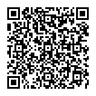

---
title: "Registratie"
--- 

```{r, echo=FALSE, out.width="75%", out.height="75%"}

```

 <script src="https://kit.fontawesome.com/a076d05399.js" crossorigin="anonymous"></script>
 
<!---
https://stackoverflow.com/questions/30110377/saving-leaflet-output-as-html
--->
  
```{r, globalsettings, echo=FALSE, warning=FALSE, message=FALSE, results='hide'}
library(knitr)
library(tidyverse)
library (kableExtra)
opts_chunk$set(tidy.opts=list(width.cutoff=100),tidy=TRUE, warning = FALSE, message = FALSE,comment = "#>", cache=TRUE, class.source=c("test"), class.output=c("test2"), cache.lazy = FALSE)
options(width = 100) 
rgl::setupKnitr()

colorize <- function(x, color) {sprintf("<span style='color: %s;'>%s</span>", color, x) }

```

```{r klippy, echo=FALSE, include=TRUE, message=FALSE}
# install.packages("remotes")
#remotes::install_github("rlesur/klippy")
klippy::klippy(position = c('top', 'right'))
#klippy::klippy(color = 'darkred')
#klippy::klippy(tooltip_message = 'Click to copy', tooltip_success = 'Done')
```

--- 

# Inschrijvingsformulier 

Inschrijven voor de Dag van de Sociologie op donderdag 19 juni 2025 kan via onderstaande QR code of [deze link](https://app.clubcollect.com/forms/nl/nsv/inschrijfformulier-dag-van-de-sociologie-2025). U wordt doorgestuurd naar een invulformulier en betaalsysteem. De deadline voor aanmelding is verlengd tot **15 juni**.

```{r, echo=FALSE, out.width="30%", out.height="30%"}

```

## Deelnamekosten 

Leden van de Nederlandse Sociologische Vereniging krijgen korting op deelname aan de Dag van de Sociologie. Bent u nu nog geen lid, maar wilt u graag lid worden, dan kunt u dit op het inschrijfformulier aangeven. 


```{r, echo = FALSE}
a <- c("", "DvdS-deelname voor NSV-leden", "DvdS-deelname + NSV-lidmaatschap (t/m 31-12-2025)", "DvdS-deelname zonder NSV-lidmaatschap", "DvdS-deelname voor NSV-ereleden" )
b <- c("Niet-student", "100 euro", "166 euro", "175 euro", "gratis" )
c <- c("Bachelor- of masterstudent", "25 euro", "50 euro", "25 euro", "" )
df <- data.frame(a=a, b=b, c=c)

knitr::kable(df, align = "lcc", booktabs = TRUE, col.names = NULL) %>%
  kable_styling(latex_options = "striped") %>% 
    kable_styling(font_size = 14) %>% 
  row_spec(1, color = 'white', background = 'darkgrey') 


```

*Deelnamekosten worden niet gerestitueerd.*


